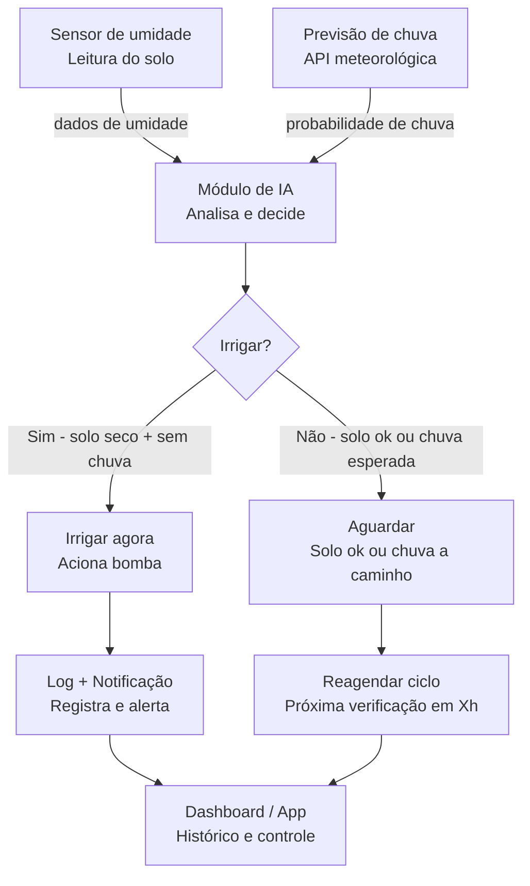

# Smart Garden

## Sobre o Projeto

**Projeto:** Smart Garden

**Problema que resolve:** Automatizar a irrigação de plantas evitando desperdício de água ao considerar a umidade do solo e a previsão de chuva.

## Arquitetura

## Integrantes

| Nome                             | GitHub             |
| -------------------------------- | ------------------ |
| Maximus Daniel Nascimento        | [@maximusdn]       |
| Jonathan Ribeiro                 | [@JonathanRbo-puc]    |
| Gabriel Henrique Rodrigues Rocha | [@RickRocha022] |
