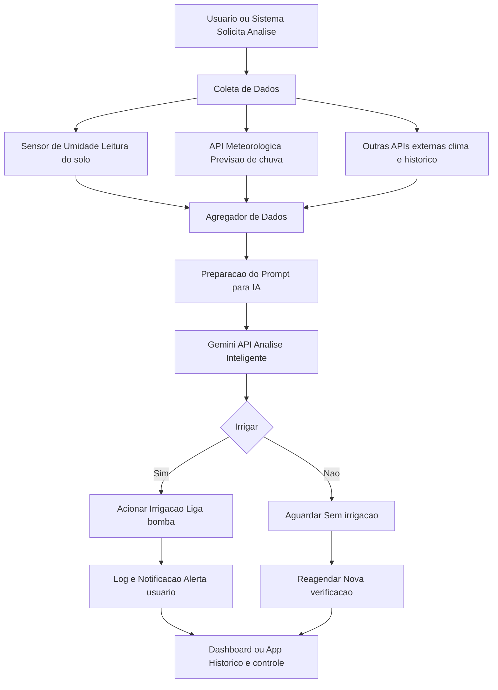

# Smart Garden

## Sobre o Projeto

**Projeto:** Smart Garden

**Problema que resolve:** Automatizar a irrigação de plantas evitando desperdício de água ao considerar a umidade do solo e a previsão de chuva.

## Arquitetura

```mermaid
flowchart TD
    A[Usuario ou Sistema Solicita Analise] --> B[Coleta de Dados]

    B --> C1[Sensor de Umidade Leitura do solo]
    B --> C2[API Meteorologica Previsao de chuva]
    B --> C3[Outras APIs externas clima e historico]

    C1 --> D[Agregador de Dados]
    C2 --> D
    C3 --> D

    D --> E[Preparacao do Prompt para IA]

    E --> F[Gemini API Analise Inteligente]

    F --> G{Irrigar}

    G -->|Sim| H[Acionar Irrigacao Liga bomba]
    G -->|Nao| I[Aguardar Sem irrigacao]

    H --> J[Log e Notificacao Alerta usuario]
    I --> K[Reagendar Nova verificacao]

    J --> L[Dashboard ou App Historico e controle]
    K --> L
``` 

## Como funciona:

O Smart Garden funciona a partir da coleta de dados informados automaticamente pelo sistema ou solicitados pelo usuário, como a umidade do solo medida por sensores e a previsão de chuva obtida por APIs externas, essas informações passam por um processamento onde são organizadas e enviadas para o Gemini, que analisa as condições do ambiente e decide se é necessário irrigar ou não, como saída, o sistema executa a ação correspondente, acionando a irrigação quando necessário ou aguardando, além de registrar as informações e enviar notificações ao usuário.
## Integrantes

| Nome                             | GitHub             |
| -------------------------------- | ------------------ |
| Maximus Daniel Nascimento        | [@maximusdn]       |
| Jonathan Ribeiro                 | [@JonathanRbo-puc]    |
| Gabriel Henrique Rodrigues Rocha | [@RickRocha022] |
